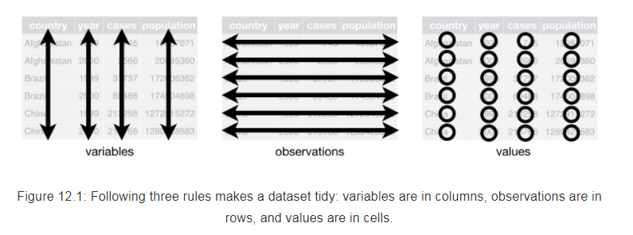
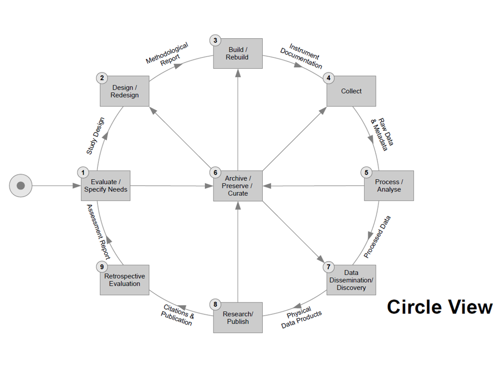

# Tidy data

## Slogan
> Write documentation for humans. Write data for computers.

## What challenges do _you_ face?

## Note on file organization

 `data/raw/`
 `data/clean/`
 `processing/`
 `analysis/`


## Note on file formats

Preferred:

> * plain text
> * open (non-proprietary) format (= I don't need to buy software to view this)

## Data is tidy if...

> 1. each observation occupies a single row
> 2. each variable occupies a single column
> 3. one type of observations resides in a single table.

----



## Easy?

## Yeah, right

> * Is observation...
>     * a survey submission? 
>     * each response in that submission?
> * What separates kinds of observation? 
> * What separates observations from variables? (`work_phone` vs. `home_phone`)
> * Might depend on context and discretion, but broad intuitions apply broadly

## Negative definition

Messy data is usually messy in the following ways:

> * Column headers are values, not variable names
> * Multiple variables are stored in one column
> * Variables are stored in both rows and columns
> * Multiple types of experimental unit stored in the same table
> * One type of experimental unit stored in multiple tables

## Origin

[Hadley Wickham's (2014) Tidy Data paper.](https://www.jstatsoft.org/article/view/v059i10) 

Do read it for details and more formal definitions.

# Messy dataset example: Your plans for SIPS

```{r, eval=FALSE, include=FALSE}
library(tidyverse)
library(generator)
x <- read_csv('data/raw/plans_original.csv')
x$Name <- r_full_names(nrow(x))
x$`Email address` <- r_email_addresses(nrow(x))
x <- x[, 1:6]
head(x)
glimpse(x)
write_csv(x, 'data/raw/plans_raw.csv')
```

----

* Remember that form you filled out? We'll look at the CSV output from Google Forms.
* (Examples are a little `R` heavy, but many tools do the same)

```{r, include=FALSE}
library(tidyverse)
library(knitr)
x <- read_csv('data/raw/plans_raw.csv')
```

## What are the problems here? (1/2)

```{r, asis=TRUE}
knitr::kable(x[106, 1:4], row.names = FALSE)
```
----

## What are the problems here? (2/2)

```{r, echo=FALSE, asis = TRUE}
knitr::kable(x[106, 5:6], row.names = FALSE)
```
----

## Basic issues
> * Unwieldy column names
> * What timezone is the datetime? _(More in the *Metadata* section)_
> * Ambiguous use of commas
> * Identifying personal information
> * Brian's social is listed on the wrong day
> * _Mistakes? (Double submission, ...)_

----

```{r}
# Read the file in with better headers
library(readr)
x <- read_csv('data/raw/plans_raw.csv',
              col_names = c("time_submitted", "name", "email", 
                            "day1", "day2", "day3"),
              col_types = list(
                col_datetime(format = '%m/%d/%Y %H:%M:%S'), 
                col_character(), col_character(), 
                col_character(), col_character(),
                col_character()),
              skip = 1) # skip 1 row (headers)
head(x)
```

----


```{r}
knitr::kable(x[106, 4:6], row.names = FALSE)
```

## Mess #1: mixing different data sets
> * Our datasets centers on plans for specific events. Why do we have people's emails here?
> * _This becomes especially problematic with the next mess._

(tidy data illustration)

----

**Tidy solution:** divide the data units into tables you can re-merge

```{r}
people <- select(x, time_submitted, name, email) %>% unique()
people$data_origin <- 'plans_raw.csv' # if many possible sources

# if non-existent, create an ID to join the tables by. 
# (Usually, you might have an ID for each participant at 
# this point, which you'd now deidentify.)
people$participant_ID = sample(1:nrow(people), nrow(people))

# separate out the dataset, enable later connection with index
x <- merge(x, people) %>% select(-time_submitted, -name, -email)
```

> * _Should we separate the table of events and plans, too?_

----

As a bonus, sensitive info is relegated to a single spot, and is easier to deal with:

```{r}
# we don't want to share the name info, but we can extract 
# non-identifying metadata of interest
people <- transmute(people, 
                    time_submitted, participant_ID,
                    email_server = gsub('.+@([^@]+)$', '\\1', email),
                    tld = gsub('.+\\.(\\w{1,7}$)', '\\1', email),
                    number_names = length(strsplit(name, ' ')[[1]])
)
```
```{r, echo=FALSE, asis = TRUE}
knitr::kable(people[1, ], row.names = FALSE)
```
----

## Mess #2: Data stored in column names

> * Each column stores the date on which the event is held.
> * Even though we renamed it from `...August 1` to `day1`, that is still plan-level info


```{r, echo = FALSE}
knitr::kable(x[106, ], row.names = FALSE)
```

----

**Tidy solution:** translate the data from wide to long

```{r}
x <- tidyr::gather(x, event_day, event, -participant_ID)
x$event_day <- as.numeric(gsub('day', '', x$event_day)) # clean up
```
```{r, echo = FALSE}
knitr::kable(x[106:107, ], row.names = FALSE)
```

* _Side effect: some people are now planning for `NA`. Why?_

## Mess #3: Multiple records in a single row
> * As many plans as there were checkboxes
> * Doing any sort of math on this is annoying

----

**Tidy solution:** One row per one planned event

_(assuming we fixed the comma issue)_

```{r, echo = FALSE}
# we want to quote the content of each cell, or escape the commas that aren't descriptive
# create ad-hoc function to do this correct when needed
escape_multiple_values <- function(values) {
  library(stringr)
  # got these unique strings from Ctrl+F the form, but in larger datasets, things might be more difficult
  to_quote = c("Saturday, July 29th, 7p", "Part 1: IRB, Part 2: Curating data", 
               "transparent, reproducible, and fabulous", 
               "department, university, society", 
               "if there is a hackathon that needs help, let me know")
  # we temporarily escape the separators
  replacements = str_replace_all(to_quote, ',', '@+@')
  names(replacements) <- to_quote

  str_replace_all(values, replacements)
}
 
# escape_multiple_values(c("[Saturday, July 29th, 7p] Dinner/drinks party at Brian Nosek's home (bus transportation to/from Omni hotel all evening), Workshop: Fundamentals of meta-analysis (9:30a-12:30p), Workshop: How to Promote Transparency and Replicability as a Reviewer (1:30-3:30p), Workshop: Writing papers to be transparent, reproducible, and fabulous (3:30-5:30p)", "Workshop: How to Promote Transparency and Replicability as a Reviewer (1:30-3:30p), Workshop: Writing papers to be transparent, reproducible, and fabulous (3:30-5:30p), Hack: Resources for changing culture in department, university, society (all day), I am flexible; if there is a hackathon that needs help, let me know."))

unescape_multiple_values <- function(values) {
  str_replace_all(values, '@\\+@', ',')
}
```

```{r, echo = FALSE}
# this is where we use the previous fix
x$event <- escape_multiple_values(x$event)
```
```{r}
x <- separate_rows(x, event, sep = ', ')
```
```{r, echo = FALSE}
# unescape the event titles
x$event <- unescape_multiple_values(x$event)
```
----

We can now easily fix the mis-dating of Brian's social, which - as an artifact of survey design - would otherwise still be considered a Day 1 event:

```{r}
# With just one mis-dated event, we can just re-date it
x$event_day[x$event == paste0("[Saturday, July 29th, 7p] ", 
  "Dinner/drinks party at Brian Nosek's home (bus ",
  "transportation to/from Omni hotel all evening)")] <- 0
```

## Mess #4: Multiple variables in a single column
```{r, echo = FALSE}
knitr::kable(x[106, ], row.names = FALSE)
```

> * All mashed up in `event`: event time, event name, and event type

----

```{r, echo = FALSE, include = FALSE}
# Mostly constant position (Type: name (time)), so extract it like that
# This won't work for all
xtest <- extract(x, event, 
                 c('event_type', 'event_name', 'event_time'), 
                 regex = "(^[[:alnum:]-]+): (.+) \\((.+)\\)$", 
                 remove = FALSE)

# What events did this not work for?
xtest %>% filter(is.na(event_type)) %>% select(event) %>% unique() 
```

```{r, echo = FALSE}
# modify events to fit in the regex
x$event[x$event == "[Saturday, July 29th, 7p] Dinner/drinks party at Brian Nosek's home (bus transportation to/from Omni hotel all evening)"] <- "Social: Dinner/drinks party at Brian Nosek's home (7p-?)"
x$event[x$event == "All Conference Social Event (Dinner+drinks; 7:30p-??)"] <- "Social: All Conference Dinner & Drinks (7:30p-??)"
```

```{r}
# Structure of `event` is stable (Type: name (time)), so 
# a regular expression can extract it
#
# (Not shown: slight data manipulation to make this work for all events)
x <- extract(x, event, 
             c('event_type', 'event_name', 'event_time'), 
             regex = "(^[[:alnum:]-]+): (.+) \\((.+)\\)$", 
             remove = FALSE)
```

## Mess #5: Multiple types of experimental unit in the same table

> * "I'm flexible" isn't a plan for a specific event.
> * _**Question**: Should such responses be removed or re-defined? When should curation remove responses?_
>     * _Relevant: What does a plan for `NA` event mean?_

```{r, echo = FALSE}
knitr::kable(x[106, ], row.names = FALSE)
```

----

```{r}
flexible_responses <- c("Everything else will be scheduled during the conference depending on what has legs and group interest", 
                        "I am flexible; if there is a hackathon that needs help, let me know.")

# Removal:
# x <- filter(x, !(event %in% flexible_responses))

# Re-definition
x$event_type[x$event %in% flexible_responses] <- "Flexible"
```

## Mess #6: One type of experimental unit stored in multiple tables

> * Can you imagine examples?
> * If we had a separate survey which also asked identifying info, the `people` table would probably run into duplicates.

## Could we make things even cleaner?
> * Add `event_date`
> * Convert `event_time` to `event_starttime` and `event_duration`
> * Remove `event`, as we've extracted everything out of it
> * In fact, separate out `events.csv` into its own table and join by `event_id`

## Real artists ~~ship~~ publish

```{r}
x <- select(x, -event)
write_csv(x, 'data/clean/event_plans.csv')
write_csv(people, 'data/clean/people.csv')
```
```{r, echo = FALSE}
knitr::kable(x[106, ], row.names = FALSE)
```


# Things are easier with a tidy data set

## Tidy data are like a toothpaste

> * A tidy dataset is easy to push into "messy" forms, but backwards doesn't work quite as well.
> * Quick exploration!

## Question 1

```{r, echo = FALSE}
library(ggplot2)
library(forcats)
theme_set(theme_bw() + theme(title = element_text(size = 16), 
                             axis.title = element_text(size = 13),
                             axis.text = element_text(size = 12)))

popularity <- ggplot(x %>% filter(event_day %in% 1:2), 
                     aes(x = fct_infreq(event_name), fill = event_type)) + 
  geom_bar() + 
  xlab("") + ylab("# of interested attendees") +
  ggtitle("Which events are most appealing?") +
  theme_bw() + theme(axis.text.x = element_text(angle = 70, hjust = 1))
popularity
```

----

```{r, echo = FALSE}
popularity + 
  facet_wrap(~ event_day, scales = "free", nrow = 1, 
             labeller = as_labeller(function(x) paste0("Day ", x))) +
  ggtitle("Which events are most appealing in each day?")
```

## Question 2

```{r, echo = FALSE}
ggplot(people,
       aes(x = time_submitted)) + 
  stat_bin(aes(y = cumsum(..count..)), geom="step", binwidth = 1800) +
  ggtitle("How fast do SIPS attendees respond to organizer requests?") + 
  xlab("Date") + ylab("Cumulative number of responses") +
  scale_x_datetime(date_breaks = "1 days") +
  theme_bw() + theme(axis.text.x = element_text(angle = 30, hjust = 1))
```


## Question 3

```{r, echo = FALSE}
all = merge(x, people) # by = 'participant_ID' is implied
ggplot(all %>% group_by(participant_ID, time_submitted) %>% summarize(number_plans = n()), 
       aes(y = number_plans, x = time_submitted)) + 
  geom_jitter(height = 0.1, alpha = 0.9) +
  ggtitle("Do late submitters plan to attend fewer events?") + 
  xlab("Submission date") + ylab("Number of planned events") +
  theme_bw() + 
  scale_x_datetime(date_breaks = "1 days") + theme(axis.text.x = element_text(angle = 30, hjust = 1))
```

# Tidy tools

## It's not just R

* Google Refine
* Data Wrangler
* Excel "Table" + pivot table shenanigans
* All statistical software has some version of reshaping tools

----

...but if you're looking for R, [`tidyverse`](http://tidyverse.org/) is excellent

# Tidy woes?

# Metadata

----

> * Study- and table-level documentation
> * How the data was collected & why

## The time to document metadata is always



# Option 1: Standardized metadata

* Most common in social science: DDI (Documenting Data Initiative)
    * Lifecycle standard
    * Slimmed-down Codebook standard
* Alternative standards exist: [Dublin Core](http://dublincore.org/), [MINSEQE](http://fged.org/projects/minseqe/) (genomics), [MIBBI](https://biosharing.org/standards/?selected_facets=isMIBBI:true&view=table) (biology + biomedicine), ...

----


## Pros

> * Very, **very** thoroughly standardized & documented
> * XML, so machine-readable
> * Connects into other existing frameworks
> * Ideal for extensive datasets

## Cons

* Far too thoroughly standardized - steep learning curve
* XML, so not super human-friendly
* Overkill for small-ish datasets

## Tools

* [Colectica software](http://www.colectica.com), especially the free [Colectica for Excel](http://www.colectica.com/software/colecticaforexcel) (Windows-only)
* [Archivist](https://github.com/CLOSER-Cohorts/archivist) by UK's CLOSER
* XML editors: 

# Option 2: "Readme" metadata

* Flexible description in plain text
* Many templates available - [Cornell Library has an excellent one](https://cornell.app.box.com/v/ReadmeTemplate)

# Documenting our SIPS dataset

## Basics
1. Title of Dataset: **Preliminary plans of SIPS 2017 attendeees**
2. Author Information
    * Principal Investigator Contact Information
        * Name: **David Condon**
            * Institution: Northwestern University
            * Email: david-condon@northwestern.edu
    * Associate or Co-investigator Contact Information
        * Name: **Simon Podhajsky**
            * Institution: Yale University
            * Email: simon.podhajsky@yale.edu
3. Date of data collection (single date, range, approximate date) **20170713-20170725**
4. Geographic location of data collection (where was data collected?): **online**
5. Information about funding sources that supported the collection of the data: **COS / its funders**

## Basics (cont'd)
1. Licenses/restrictions placed on the data: **MIT**
2. Links to publications that cite or use the data: -
3. Links to other publicly accessible locations of the data: -
4. Links/relationships to ancillary data sets: **~~SIPS 2017 registrations~~**
5. Was data derived from another source? -
6. Recommended citation for the data: **_forthcoming_**

## Data and file overview
1. File List
   A. Filename: **`people.csv`** 
      Short description: Properties of SIPS attendees
   B. Filename: **`event_plans.csv`**     
      Short description: Plans for events by participant, with description of events
2. Relationship between files: **`people.csv` provides participant data for `event_plans.csv` (one-to-many)**
3. Additional related data collected that was not included in the current data package: **~~flexible plans,~~ participant registration**

## Data and file overview (cont'd)
4. Are there multiple versions of the dataset? **no**
   If yes, list versions:
           Name of file that was updated:
                     i. Why was the file updated? 
                ii. When was the file updated?

## Methodological information
1. Description of methods used for collection/generation of data (include references): **Google Form sent to registered participants via e-mail**
2. Methods for processing the data: **Export to CSV, then running `tidying_sips_plans.Rmd`**
3. Instrument- or software-specific information needed to interpret the data: **none, but R 3.4+ preferred**
4. Standards and calibration information, if appropriate: **-**

## Methodological information (cont'd)
5. Environmental/experimental conditions: **-**
6. Describe any quality-assurance procedures performed on the data: **-**
7. People involved with sample collection, processing, analysis and/or submission: **Katie & Brian & ... (collection), Simon (processing & analysis), David (submission)**

## `event_plans.csv`

1. Number of variables: **5**
2. Number of cases/rows: **1260**
3. Variable List
    A. Name: **`participant_ID`**
       * Description: **unique participant index linked to the person data in `people.csv`**
    B. Name: **`event_type`**
       * Description: **The format of the event the participant is planning to attend**
       * Possible values: **Social, Hack, Re-hack, Workshop, Flexible, `NA`** _(and meanings)_
    C. Name: **...**

## `event_plans.csv` (cont'd)

4. Missing data codes: **-**
5. Specialized formats of other abbreviations used: **-**

## `people.csv`
...

# Resources
* Tidyverse (original paper, presentation, write-up, book)
* `tidyverse` (`dplyr` and `tidyr`) R package cheatsheet
* UC Mercedes recommendations on file management
* Documenting Data Initiative
    * Video presentations are least impenetrable
* ICSPR
* Cornell's Research Data Management Service Group on metadata